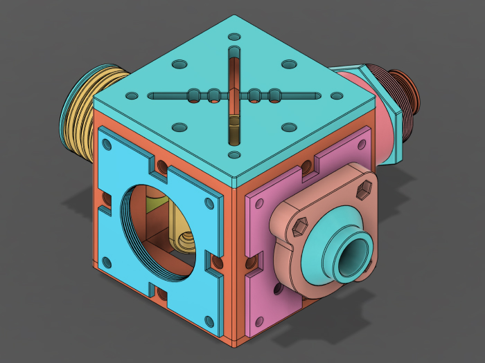
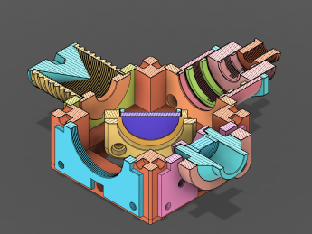
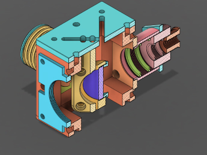
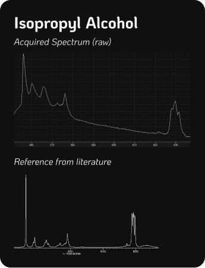
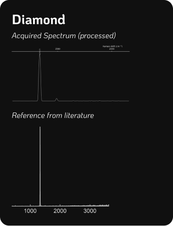

# CubeRaman
*3D-Printed Raman Spectroscopy*
--- 

This repo is currently under construction. It is the more compact and simplified iteration of my [DIYraman (GitHub)](https://github.com/jacobbusshart/DIYraman) build.

*Images do not depict the acquired parts: Spectrometer Unit, Laser, Microscope Objective, Longpass Filter, Focusing Lens, Screws, Nuts and Magnets*

---

## Sample Spectra

Examples of the expected spectral performance without any adjustments. Unprocessed acquired spectrum vs. processed reference spectrum. Taken before tuning the 45° dichroic mirror at all.  

---

# Parts needed

| Part                                                                                       | Description / Specification                                       | Cost                          |
| ------------------------------------------------------------------------------------------ | ----------------------------------------------------------------- | ----------------------------- |
| [DMLP550](https://www.thorlabs.com/item/DMLP550)                                           | Ø1" Longpass Dichroic Mirror, 550nm Cut-On                        | 
195€
     |
| [FELH0550](https://www.thorlabs.com/item/FELH0550)                                         | Ø25.0mm Longpass Filter, 550nm Cut-On                             | 
150€
     |
| [#65640](https://www.edmundoptics.com/p/532nm-cwl-10nm-fwhm-125mm-mounted-diameter/20158/) | Bandpass Filter 532nm, 10nm FWHM                                  | 
95€
      |
| [AC127-019-A](https://www.thorlabs.com/item/AC127-019-A)                                   | Ø1/2" Achromatic Doublet, f=19mm                                  | 
59€
      |
| Microscope Objective                                                                       | Any used/new infinity-corrected 20x                               | 
50€
      |
| [B&W Tek BTC 100-2S](https://ebay.us/m/y6hDoC)                                             | Surplus spectrometer unit, 100μm slit, 450-650nm                  | 
180€
     |
| [532nm Laser Pointer](https://aliexpress.com/item/1005004415839015.html)                   | Any (cheap) 532nm laser module, >30mW                             | 
10€
      |
| [Fiber Optic Cable](https://aliexpress.com/item/1005008245139319.html)                     | ~~(Optional) Any optical fiber, SMA905 connector, 200μm core~~ | ~~
53€
~~  |
| + Various                                                                                  | M3 Screws + Nuts, M3 Heat Set Inserts,  Magnets 6x2mm          | 
10€
      |
|                                                                                            | 
**TOTAL**
                                    | 
**799€**
 |

High-quality laser safety glasses are mandatory to protect your eyes from the powerful laser and its reflections. Buy a certified pair from a reputable supplier, not Aliexpress! They should be rated for the laser's wavelength at 532nm. I bought [these](https://protect-laserschutz.de/de/shop/~p1924) from a local German brand for around 130€.

--- 
## 3D-Printed Parts

All parts were printed on a Bambu P1S using high resolution exports out of Fusion and sliced using BambuStudio

- PETG-CF (Black) 
- 0.4mm Hardened Steel Nozzle
- 0.12mm Layer height
- 50% Gyroid infill
- Seam position Nearest or Random
- Precision parameters set to 0.001mm