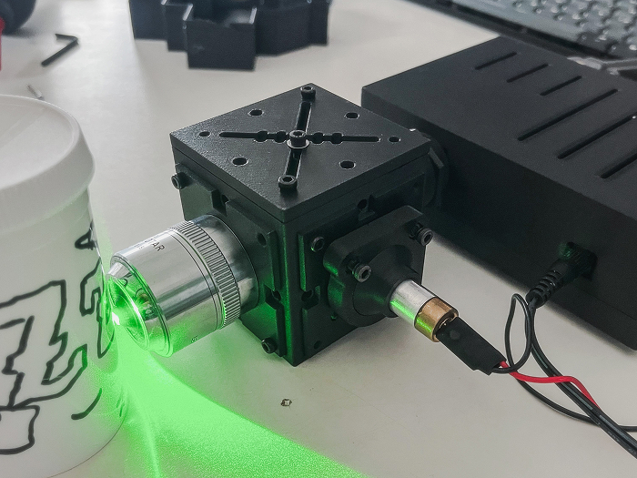
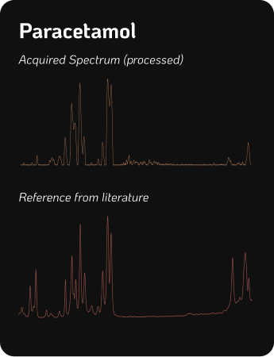
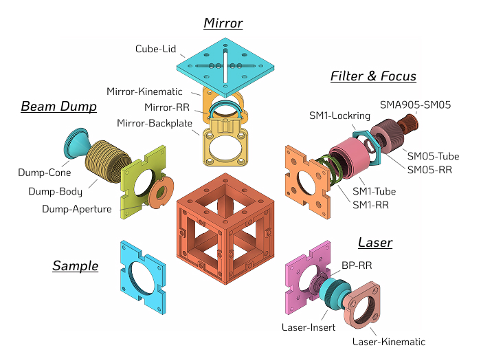
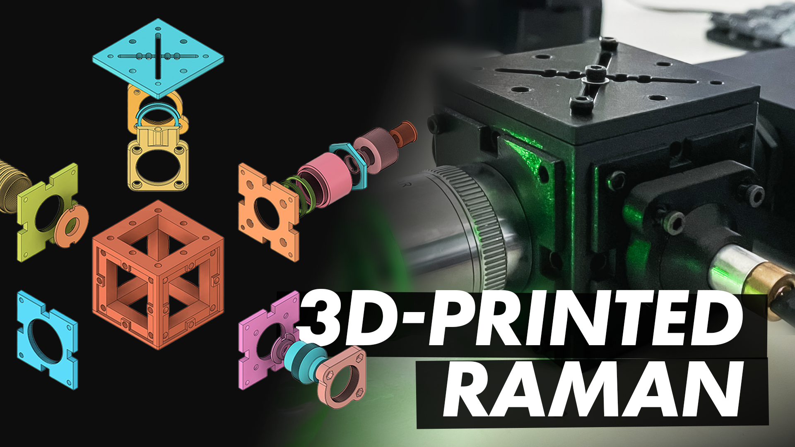
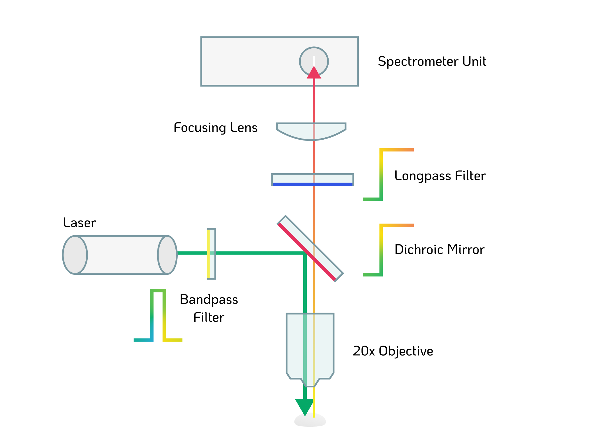
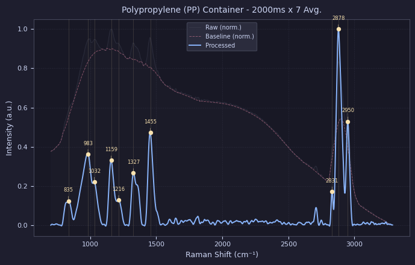
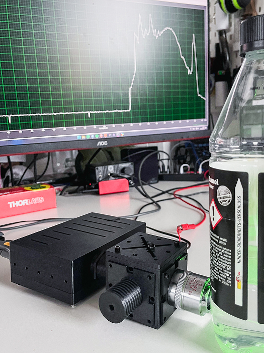

# CubeRaman

*3D-Printed Raman Spectrometer*

This project aims to make Raman spectroscopy more accessible, replicable and - in the first place - affordable. It can be used to non-destructively identify chemicals, polymers, pharmaceuticals and minerals in an experimental setting.

*This repo is currently under construction. It is the more compact and simplified iteration of my [DIYraman (GitHub)](https://github.com/jacobbusshart/DIYraman) build.*

It is designed in a back-scattering configuration - both exciting and collecting through the microscope objective. It uses a 532nm laser at ~30mW, utilizing filters with a cut-on at 550nm, which effectively allows for Raman measurements in the wavenumber range of 600cm-1-3000cm-1

---
## Sample Spectra

Examples of the expected spectral performance. The resolution - how narrow or wide a peak is and thus their separability - is determined by a multitude of factors. With the main bottleneck of the system being the 100 micron input slit of the spectrometer unit. The beam diameter is also a factor, along with its stability and IR-leakage. A higher resolution spectrometer will definitely yield significantly better results - though at a significant cost.

--- 

## 3D-Model

*Images do not depict the acquired parts: Spectrometer Unit, Laser, Microscope Objective, Longpass Filter, Focusing Lens, Screws, Nuts and Magnets*

A more detailed overview of the printed parts are depicted in the section below.

---

## Sourced Parts

| Part                                                                                       | Description / Specification                                       | Cost                          |
| ------------------------------------------------------------------------------------------ | ----------------------------------------------------------------- | ----------------------------- |
| [DMLP550](https://www.thorlabs.com/item/DMLP550)                                           | Ø1" Longpass Dichroic Mirror, 550nm Cut-On                        | 
195€
     |
| [FELH0550](https://www.thorlabs.com/item/FELH0550)                                         | Ø25.0mm Longpass Filter, 550nm Cut-On                             | 
150€
     |
| [#65640](https://www.edmundoptics.com/p/532nm-cwl-10nm-fwhm-125mm-mounted-diameter/20158/) | Bandpass Filter 532nm, 10nm FWHM                                  | 
95€
      |
| [AC127-019-A](https://www.thorlabs.com/item/AC127-019-A)                                   | Ø1/2" Achromatic Doublet, f=19mm                                  | 
59€
      |
| Microscope Objective                                                                       | Any used/new infinity-corrected 20x                               | 
50€
      |
| [B&W Tek BTC 100-2S](https://ebay.us/m/y6hDoC)                                             | Surplus spectrometer unit, 100μm slit, 450-650nm                  | 
180€
     |
| [532nm Laser Pointer](https://aliexpress.com/item/1005004415839015.html)                   | Any (cheap) 532nm laser module, >30mW                             | 
10€
      |
| [Fiber Optic Cable](https://aliexpress.com/item/1005008245139319.html)                     | ~~(Optional) Any optical fiber, SMA905 connector, 200μm core~~ | ~~
53€
~~  |
| + Various                                                                                  | M3 Screws + Nuts, M3 Heat Set Inserts,  Magnets 6x2mm          | 
10€
      |
|                                                                                            | 
**TOTAL**
                                    | 
**749€**
 |

**<u>High-quality laser safety glasses are mandatory to protect your eyes from the powerful laser and its reflections!</u>** Buy a certified pair from a reputable supplier, not Aliexpress! They should be rated for the laser's wavelength at 532nm. I bought [these](https://protect-laserschutz.de/de/shop/~p1924) from a local German brand for around 130€.

---
## 3D-Printed Parts

### Base Cube & Sides

Print the base cube along with the side plates first. Afterwards print the rest of the grouped parts below.

All parts were printed without supports and are only printed once!

| Base Cube + Sides       |
| ----------------------- |
| Base-Cube               |
| Base-Cube-Top           |
| Cube-Insert_Sample      |
| Cube-Insert_Dump        |
| Cube-Insert_Laser       |
| Cube-Insert_FilterFocus |

### Parts

| **Laser**       | **Mirror**       | **Filter & Focus** | **Beam Dump** | **Sample** |
| --------------- | ---------------- | ------------------ | ------------- | ---------- |
| Laser-Insert    | Mirror-Kinematic | SM1-Tube           | Dump-Body     | -          |
| Laser-Kinematic | Mirror-Backplate | SM05-Tube          | Dump-Cone     |            |
| BP-RR           | Cube-Lid         | SM1-Lockring       | Dump-Aperture |            |
|                 | Mirror-RR        | SMA905-SM05        |               |            |
|                 |                  | SM1-RR (2x)        |               |            |
|                 |                  | SM05-RR (2x)       |               |            |

| **Extras**     |
| -------------- |
| Spanner_SM1RR  |
| Spanner_SM05RR |

Printed on a Bambu P1S using high resolution exports out of Fusion and sliced using BambuStudio

- PETG-CF (Black) 
- 0.4mm Hardened Steel Nozzle
- 0.12mm Layer height
- 4 Walls, 50% Gyroid infill
- Seam position Nearest or Random
- Precision parameters set to 0.001mm
 
---

## **Build Video**

**[Click here to watch the build process! - Youtube](https://youtu.be/bUxc6mWsTgc)**

--- 

## How It Works

The **532 nm laser** fires horizontally. The **bandpass filter** strips IR leakage from the cheap diode module and narrows the laser's wavelength. The beam then hits the **DMLP550 dichroic mirror** at 45°, which reflects it 90° downward through the **20x objective** and onto the **sample**.
Backscattered light travels back up through the objective. The Raman-shifted photons (>550 nm) transmit straight through the dichroic toward the detector, while the unwanted Rayleigh-scattered 532 nm light passes into the beam dump. The **FELH0550 longpass filter** gives a second stage of Rayleigh rejection, the **f=19mm achromat** focuses the beam onto the 100 μm slit, and the **B&W Tek spectrometer** records the spectrum.

The acquired spectrum is processed to remove residual background or fluorescence interference and make it more legible. That means: cropping and calculating Raman-shift, cosmic spike removal, baseline correction, smoothing and normalizing. Additionally, peaks can be detected and fitted, though this is more relevant for high-performance/-resolution Raman instruments that have been calibrated to certified standards. 

---
## Various

Testing capabilities during calibration in full daylight: depending on the focus distance you either detect the Raman spectrum of the bottle content - in this case Ethanol/Water - or the bottle itself. This only works if your microscope objective's working distance is greater than the wall width of the container to be measured. Here the working distance is 2.4mm, which is sufficient.

