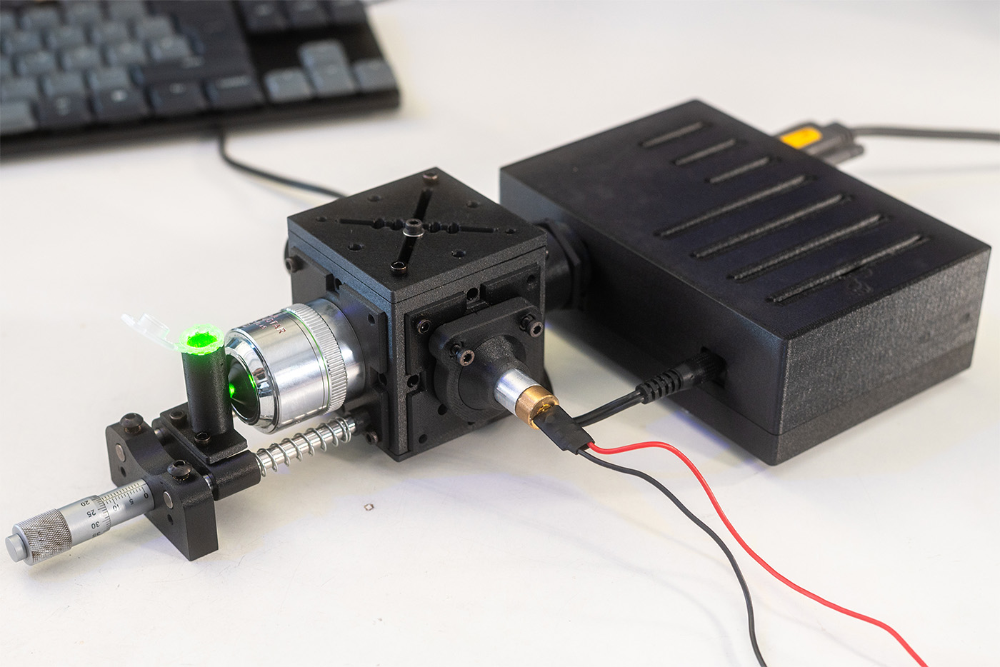
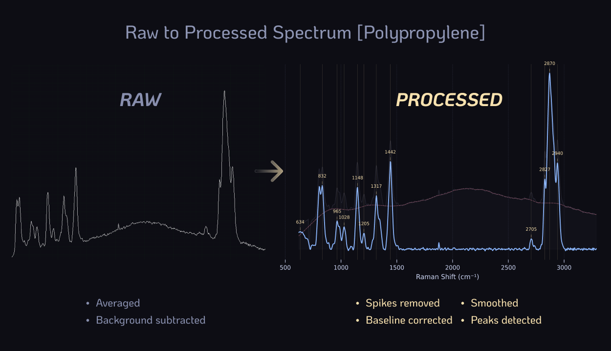
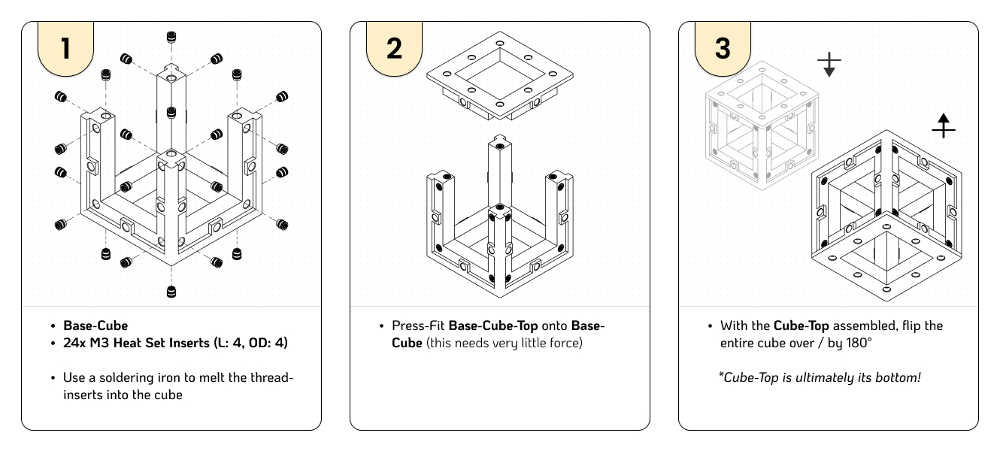
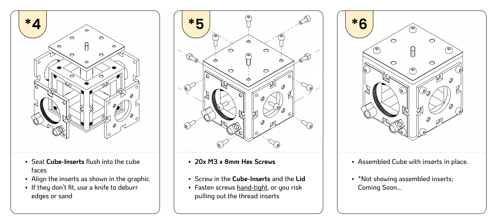
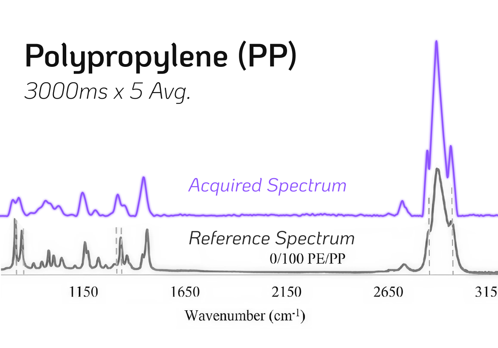

# CubeRaman

*3D-Printed Raman Spectrometer*

This project aims to make Raman spectroscopy more accessible, replicable and - in the first place - affordable. It can be used to non-destructively identify chemicals, polymers, pharmaceuticals and minerals in an experimental setting.

*This repo is currently under construction. It is the more compact and simplified iteration of my [DIYraman (GitHub)](https://github.com/jacobbusshart/DIYraman) build.*

It is designed in a back-scattering configuration - both exciting and collecting through the microscope objective. It uses a 532nm laser at ~30mW, utilizing filters with a cut-on at 550nm, which effectively allows for Raman measurements in the wavenumber range of 600cm-1- 3000cm-1

---
## Sample Spectra

Examples of the expected spectral performance. The resolution - how narrow or wide a peak is and thus their separability - is determined by a multitude of factors. With the main bottleneck of the system being the 100 micron input slit of the spectrometer unit. The beam diameter is also a factor, along with its stability and IR-leakage. A higher resolution spectrometer will definitely yield significantly better results - though at a significant cost.

--- 

## 3D-Model

*Images do not depict the acquired parts: Spectrometer Unit, Laser, Microscope Objective, Longpass Filter, Focusing Lens, Screws, Nuts and Magnets*

A more detailed overview of the printed parts are depicted in the section below.

---

## Sourced Parts

| Part                                                                                       | Description / Specification                                                                                                                            | Cost                          |
| ------------------------------------------------------------------------------------------ | ------------------------------------------------------------------------------------------------------------------------------------------------------ | ----------------------------- |
| [DMLP550](https://www.thorlabs.com/item/DMLP550)                                           | Ø1" Longpass Dichroic Mirror, 550nm Cut-On                                                                                                             | 
195€
     |
| [FELH0550](https://www.thorlabs.com/item/FELH0550)                                         | Ø25.0mm Longpass Filter, 550nm Cut-On                                                                                                                  | 
150€
     |
| [#65640](https://www.edmundoptics.com/p/532nm-cwl-10nm-fwhm-125mm-mounted-diameter/20158/) | Bandpass Filter 532nm, 10nm FWHM                                                                                                                       | 
95€
      |
| [AC127-019-A](https://www.thorlabs.com/item/AC127-019-A)                                   | Ø1/2" Achromatic Doublet, f=19mm                                                                                                                       | 
59€
      |
| Microscope Objective                                                                       | Any used/new, infinity-corrected, 20x                                                                                                                  | 
50€
      |
| [B&W Tek BTC 100-2S](https://ebay.us/m/y6hDoC)                                             | Surplus spectrometer unit, 100μm slit, 450-650nm                                                                                                       | 
180€
     |
|                                                                                            | + Any [5V / 2A+ DC Power Supply](https://amzn.eu/d/00yvyamx) (Barrel Jack) + Any [RS232-to-USB Cable](https://amzn.eu/d/01SqgRPR) for Communication |                               |
| [532nm Laser Pointer](https://aliexpress.com/item/1005004415839015.html)                   | Any (cheap) 532nm laser module, >30mW, (Ø12mm)                                                                                                         | 
10€
      |
| + Various                                                                                  | M3 Screws + Nuts, M3 Heat Set Inserts,  Magnets 6x2mm                                                                                               | 
10€
      |
| [Optional](https://aliexpress.com/item/1005008245139319.html)                              | Any Fiber Optic Cable, SMA905, +-200μm core                                                                                                            | 
(50€)
    |
|                                                                                            | 
**TOTAL**
                                                                                                                         | 
**749€**
 |

**<u>High-quality laser safety glasses are mandatory to protect your eyes from the powerful laser and its reflections!</u>** Buy a certified pair from a reputable supplier, not Aliexpress! They should be rated for the laser's wavelength at 532nm. I bought [these](https://protect-laserschutz.de/de/shop/~p1924) from a local German brand for around 130€.

---
## 3D-Printed Parts

### Base Cube & Sides

Print the base cube along with the side plates first. Afterwards print the rest of the grouped parts below.

All parts were printed without supports and are only printed once!

| Base Cube + Sides       |
| ----------------------- |
| Base-Cube               |
| Base-Cube-Top           |
| Cube-Insert_Sample      |
| Cube-Insert_Dump        |
| Cube-Insert_Laser       |
| Cube-Insert_FilterFocus |

### Parts

| **Laser**       | **Mirror**       | **Filter & Focus** | **Beam Dump** | **Sample** |
| --------------- | ---------------- | ------------------ | ------------- | ---------- |
| Laser-Insert    | Mirror-Kinematic | SM1-Tube           | Dump-Body     | -          |
| Laser-Kinematic | Mirror-Backplate | SM05-Tube          | Dump-Cone     |            |
| BP-RR           | Cube-Lid         | SM1-Lockring       | Dump-Aperture |            |
|                 | Mirror-RR        | SMA905-SM05        |               |            |
|                 |                  | SM1-RR (2x)        |               |            |
|                 |                  | SM05-RR (2x)       |               |            |

| **Extras**     |
| -------------- |
| Spanner_SM1RR  |
| Spanner_SM05RR |

Printed on a Bambu P1S using high resolution exports out of Fusion and sliced using BambuStudio

- PETG-CF (Black) 
- 0.4mm Hardened Steel Nozzle
- 0.12mm Layer height
- 4 Walls, 50% Gyroid infill
- Seam position Nearest or Random
- Precision parameters set to 0.001mm

---
## Instructions

**Draft - Work in Progress**

- I use a Bambu P1S with a 0.4mm hardened steel nozzle and extruder
- Filament is ideally non-reflective and dark / black to reduce stray light; I used black PETG-CF as it's my favorite and the matte (and also overall better) PETG
### 1. Printing

- Set "**Precision**" settings in your slicer (*may just be placebo*) 
- **No Supports** are needed for any of the parts!
- **Print Orientation**: face flat / perpendicular to the build plate - especially for threads! "**Auto-Orient**" should always do the trick.
- **Layer Height** set to at least **0.12mm**. (at least for the parts with threads or fine features) 
- "**Seam Position**" is set to **Nearest** or Random for a better fit.

- All parts should be easy to print; the Base-Cube being the most demanding, as it features overhangs. (TO BE REVISED to 45° to facilitate printing)
- For the **Cube-Inserts** and the **Cube-Lid** especially, it is best to let the build plate / part cool down before removing it. This is good practice to avoid bending the part and introducing permanent deformation.

### 2. Assembly

#### Base-Cube

**Printed Parts:** Base-Cube, Base-Cube-Top
**Sourced Parts:** (24x) M3 heat Set Inserts (Length: 4mm, Outer Diameter: 4mm), (24x) M3 x 8mm Screws

Note: You don't have to insert all the threads at first. I initially didn't put any on the bottom (of Step 1 in the graphic) and on one side, which later contains the Beam Dump and was simultaneously used as an opening to get to the adjustment screws of the 45° mirror inside. The clearances of the of the Cube-Inserts are relatively tight - even more, if the overhangs on the cube sag a little. In the testing stages I mostly used 2 screws (top-left and bottom-right) for each of the other Cube-Inserts (Laser, Sample, FilterFocus).  

**Now that the Base-Cube is set up you can start putting together the Cube-Insert sub-assemblies. The following sections *don't* need to be performed in order.** 

*Parts might have been slightly modified, assume this to be an outdated overview*

#### Laser

**Printed Parts:** Cube-Insert_Laser, Laser-Kinematic, Laser-Insert, BP-RR (only if Bandpass Filter is used)
**Sourced Parts:** 532nm Laser (Ø12mm), Recommended but optional: [Bandpass Filter #65640](https://www.edmundoptics.com/p/532nm-cwl-10nm-fwhm-125mm-mounted-diameter/20158/), 4x Magnets (Ø6mm, width: 2mm), 3x M3 x 8mm Screws + Nuts (Fine-Pitch .35 Screws / Nuts are preferred but normal also work)

 
*Laser and Bandpass Filter are not depicted in the graphic*

1. Press the *Magnets* into the openings on *Cube-Insert_Laser*. 
	1. Since the respective mating part - *Laser-Kinematic* - features 3 screws, you can also insert just 3 magnets. Though keep in mind that this will allow more stray light to enter the cube. 
2. Now press the *M3 Nuts* into *Laser-Kinematic*.
3. For best results use a hammer on the screw head while inserted to ensure the nuts are flush and inserted all the way.
	1. If you want them permanently fixed, you may use a soldering iron to lightly melt the nuts in. This isn't necessary with current sufficiently tight clearances.
4. The *Laser* module is friction press-fit into *Laser-Insert*. Ensure the Laser's front surface sits perpendicularly flush.
5. Now press the *Bandpass Filter* into the other side of *Laser-Insert*.
	1. The orientation is important as both sides feature different coatings: the purple side should face you (so you see purple when assembled). 
	2. KEEP LASER DISCONNECTED AND NEVER LOOK DIRECTLY INTO THE LASER, EVEN WHEN WEARING LASER-PROTECTION!
6. It should already sit tight, but in addition *BP-RR* is lightly screwed on until it secures the rim of the filter.
7. Finally screw the assembled *Laser-Insert* into the printed thread of *Laser-Kinematic*.
8. With the entire laser and filter assembly now sitting on *Cube-Insert_Laser*, it can be pressed into a side of *Base-Cube* and fastened with 4 screws.

#### Sample

**Printed Parts:** Cube-Insert_Sample
**Sourced Parts:** Microscope Objective (20x, Infinity-Corrected, M32-Thread)

1. Make sure the *Microscope Objective* thread matches the printed part (currently only M32 and M25 available, contact me at Jacob@Busshart.de for variations)
2. With the *Microscope Objective* positioned perpendicular on the thread, carefully thread it into *Cube-Insert_Sample*. This may require more force initially, especially the first time. 
3. When the *Microscope Objective* sits flush with the surface of *Cube-Insert_Sample*, the assembly can be pressed into the side to the left of *Cube-Insert_Laser* (or as depicted in the graphic) and fastened with 4 screws.

*MORE FOR THE FULL MICROMETER ASSEMBLY / FOCUS STAGE COMING SOON*

#### Beam Dump

**Printed Parts:** Cube-Insert_Dump, Dump-Body, Dump-Cone, Dump-Aperture
**Sourced Parts:** -

1. Screw the printed parts together.
2. *Dump-Body* being the main part, which is screwed into *Cube-Insert_Dump*. 
3. Screw on the *Dump-Cone* to create a light-sealed cavity.
4. *Dump-Aperture* is screwed on from the opposite side or as depicted in the graphic.
	1. This aperture is not strictly necessary but could improve light suppression.

The Beam Dump as a whole was designed to be as modular as possible to allow for different cone angles and aperture sizes to be tested and interchanged.

#### Filter & Focus

**Printed Parts:**  + Spanner_SM1RR, Spanner_SM05RR
**Sourced Parts:** -

 
*Longpass Filter, Focusing Lens and Spectrometer unit are not depicted in the graphic*

1. Coming soon

SEE [BUILD VIDEO](https://youtu.be/bUxc6mWsTgc)

**Draft - Work in Progress**

For future version: 
1. **Only for future reference!** ~~On the new version *Cube-Insert_Laser* also features 2 openings for magnets, as *Laser-Kinematic* sits on the inside of the cube!  Make sure the polarity of the magnets match: the orientation with the magnets visible are intended to pull onto each other, so make sure to orient the magnets accordingly when fitting them in!~~
2. ~~Screw the *M3 Screws* into the nuts from the same side. (from where the surface of the magnets is visible)~~
3. ~~On the newest version, the Laser assembly now clamps on from the inside of *Cube-Insert_Laser*.~~

---

## **Build Video**

**[Click here to watch the build process! - Youtube](https://youtu.be/bUxc6mWsTgc)**

--- 

## How It Works

The **532 nm laser** fires horizontally. The **bandpass filter** strips IR leakage from the cheap diode module and narrows the laser's wavelength. The beam then hits the **DMLP550 dichroic mirror** at 45°, which reflects it 90° downward through the **20x objective** and onto the **sample**.
Backscattered light travels back up through the objective. The Raman-shifted photons (>550 nm) transmit straight through the dichroic toward the detector, while the unwanted Rayleigh-scattered 532 nm light passes into the beam dump. The **FELH0550 longpass filter** gives a second stage of Rayleigh rejection, the **f=19mm achromat** focuses the beam onto the 100 μm slit, and the **B&W Tek spectrometer** records the spectrum.

The acquired spectrum is processed to remove residual background or fluorescence interference and make it more legible. That means: cropping and calculating Raman-shift, cosmic spike removal, baseline correction, smoothing and normalizing. Additionally, peaks can be detected and fitted, though this is more relevant for high-performance/-resolution Raman instruments that have been calibrated to certified standards. 

---

## Various

Testing capabilities during calibration in full daylight: depending on the focus distance you either detect the Raman spectrum of the bottle content - in this case Ethanol/Water - or the bottle itself. This only works if your microscope objective's working distance is greater than the wall width of the container to be measured. Here the working distance is 2.4mm, which is sufficient.