# CubeRaman

*3D-Printed Raman Spectrometer*

This project aims to make Raman spectroscopy more accessible, replicable and - in the first place - affordable. It can be used to non-destructively identify chemicals, polymers, pharmaceuticals and minerals in an experimental setting.

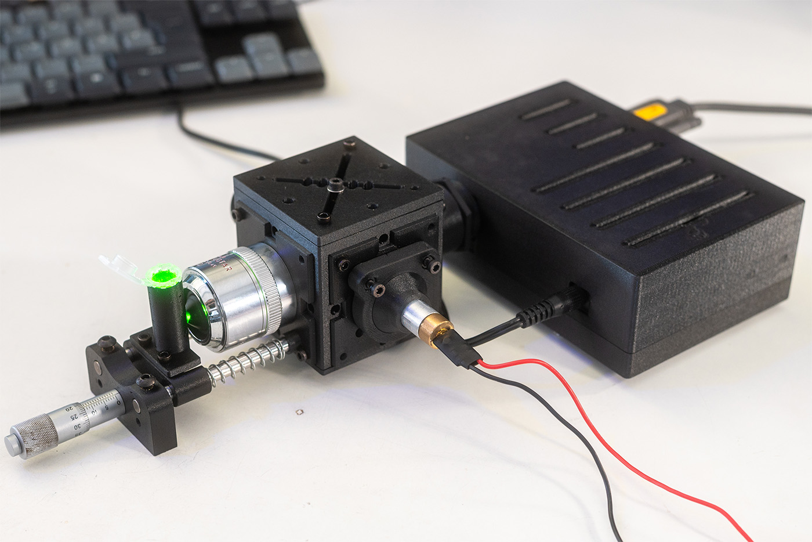

It is designed in a back-scattering configuration - both exciting and collecting through the microscope objective. It uses a 532nm laser at ~30mW, utilizing filters with a cut-on at 550nm, which effectively allows for Raman measurements in the wavenumber range of 600cm-1- 3000cm-1

> ⚠ **This build uses a Class 3B laser. Certified laser safety glasses rated for 532nm are mandatory** — see the note in [Sourced Parts](#sourced-parts). Keep the laser disconnected during assembly and never look into the beam path or the objective, even with protection on. Remove watches and rings while aligning - stray reflections mostly come as a surprise. Know your local regulations for Class 3B laser operation.

**Contents:** [Sample Spectra](#sample-spectra) · [How It Works](#how-it-works) · [3D-Model](#3d-model) · [Sourced Parts](#sourced-parts) · [3D-Printed Parts](#3d-printed-parts) · [Instructions](#instructions) · [Calibration, Alignment & First Light](#calibration-alignment--first-light) · [Software](#software) · [Build Video](#build-video) · [Various](#various)

---
## Sample Spectra
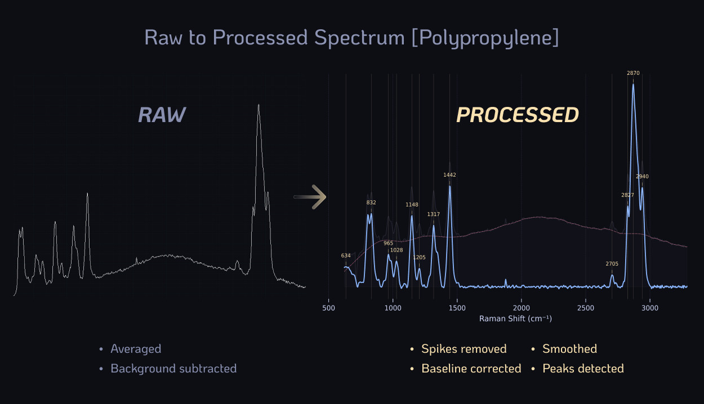
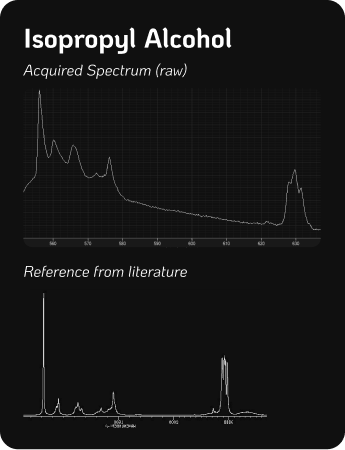

Verified so far: **polypropylene/-ethylene, paracetamol, isopropyl alcohol, ethanol, diamond, beta-carotene and more.**

Examples of the expected spectral performance. The resolution - how narrow or wide a peak is and thus their separability - is determined by a multitude of factors. With the main bottleneck of the system being the 100 micron input slit of the spectrometer unit. The beam diameter is also a factor, along with its stability and IR-leakage. A higher resolution spectrometer will definitely yield significantly better results - though at a significant cost.

---

## How It Works

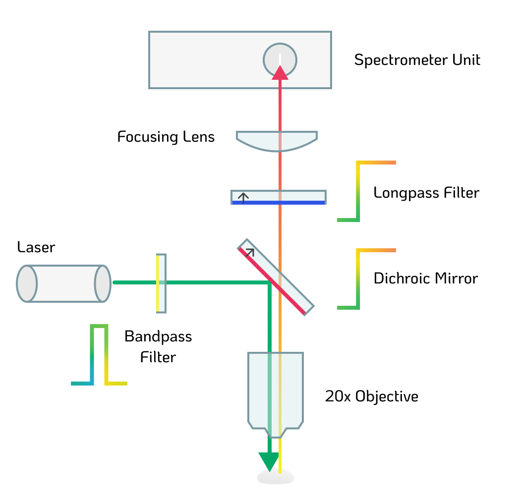

The **532 nm laser** fires horizontally. The **bandpass filter** strips IR leakage from the cheap diode module and narrows the laser's wavelength. The beam then hits the **DMLP550 dichroic mirror** at 45°, which reflects it 90° downward through the **20x objective** and onto the **sample**.
Backscattered light travels back up through the objective. The Raman-shifted photons (>550 nm) transmit straight through the dichroic toward the detector, while the unwanted Rayleigh-scattered 532 nm light passes into the beam dump. The **FELH0550 longpass filter** gives a second stage of Rayleigh rejection, the **f=19mm achromat** focuses the beam onto the 100 μm slit, and the **B&W Tek spectrometer** records the spectrum.

The acquired spectrum is processed to remove residual background or fluorescence interference and make it more legible. That means: cropping and calculating Raman-shift, cosmic spike removal, baseline correction, smoothing and normalizing. Additionally, peaks can be detected and fitted, though this is more relevant for high-performance/-resolution Raman instruments that have been calibrated to certified standards. See [Software](#software) for the included processing tool.

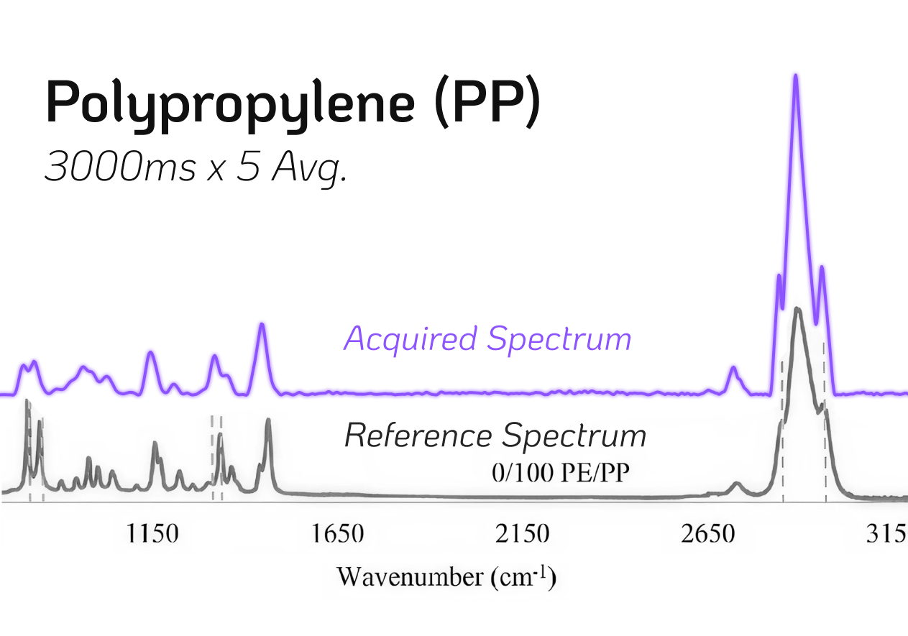

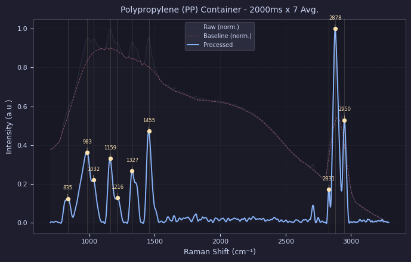

--- 

## 3D-Model

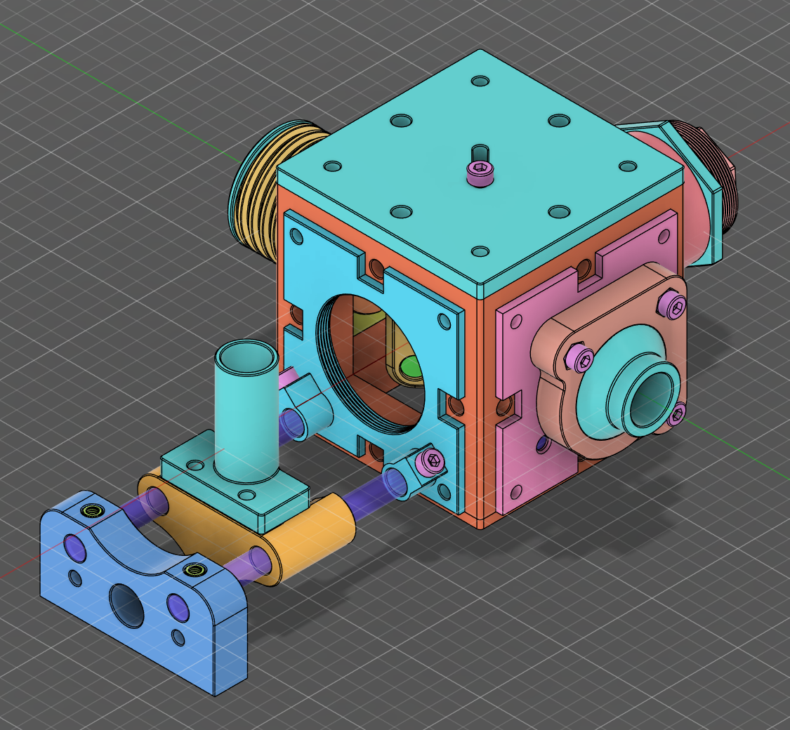
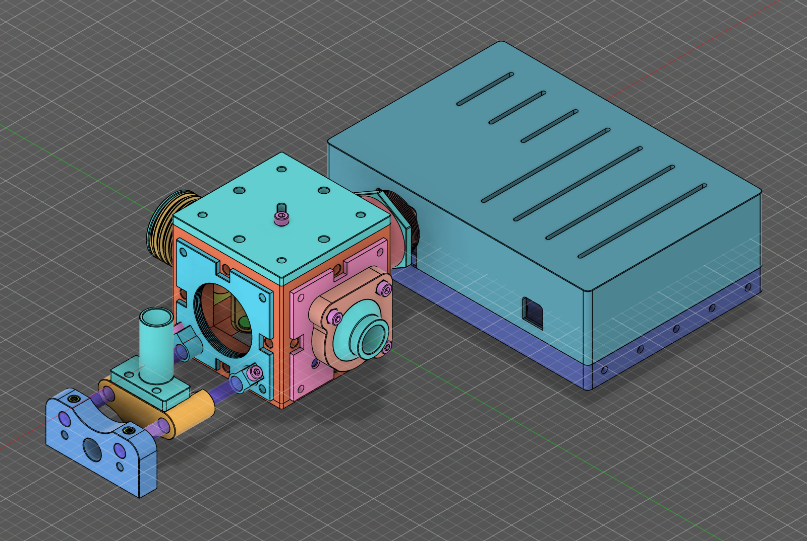

A more detailed overview of the printed parts are depicted in the section below.

---

## Sourced Parts

| Part                                                                                       | Description / Specification                                                                                                                            | Cost                          |
| ------------------------------------------------------------------------------------------ | ------------------------------------------------------------------------------------------------------------------------------------------------------ | ----------------------------- |
| [DMLP550](https://www.thorlabs.com/item/DMLP550)                                           | Ø1" Longpass Dichroic Mirror, 550nm Cut-On                                                                                                             | 
195€
     |
| [FELH0550](https://www.thorlabs.com/item/FELH0550)                                         | Ø25.0mm Longpass Filter, 550nm Cut-On (or the new 1/2" version FELH05550)                                                                           | 
150€
     |
| [#65640](https://www.edmundoptics.com/p/532nm-cwl-10nm-fwhm-125mm-mounted-diameter/20158/) | Bandpass Filter 532nm, 10nm FWHM                                                                                                                       | 
95€
      |
| [AC127-019-A](https://www.thorlabs.com/item/AC127-019-A)                                   | Ø1/2" Achromatic Doublet, f=19mm                                                                                                                       | 
59€
      |
| Microscope Objective                                                                       | Any used/new, infinity-corrected, 20x                                                                                                                  | 
50€
      |
| [B&W Tek BTC 100-2S](https://ebay.us/m/y6hDoC)                                             | Surplus spectrometer unit, 100μm slit, 450-650nm                                                                                                       | 
180€
     |
|                                                                                            | + Any [5V / 2A+ DC Power Supply](https://amzn.eu/d/00yvyamx) (Barrel Jack) + Any [RS232-to-USB Cable](https://amzn.eu/d/01SqgRPR) for Communication |                               |
| [532nm Laser Pointer](https://aliexpress.com/item/1005004415839015.html)                   | Any (cheap) 532nm laser module, >30mW, (Ø12mm)                                                                                                         | 
10€
      |
| + Various                                                                                  | M3 Screws + Nuts, M3 Heat Set Inserts,  Magnets 6x2mm                                                                                               | 
10€
      |
| [Optional](https://aliexpress.com/item/1005008245139319.html)                              | Any Fiber Optic Cable, SMA905, +-200μm core                                                                                                            | 
(50€)
    |
|                                                                                            | 
**TOTAL**
                                                                                                                         | 
**749€**
 |

**<u>High-quality laser safety glasses are mandatory to protect your eyes from the powerful laser and its reflections!</u>** Buy a certified pair from a reputable supplier, not Aliexpress! They should be rated for the laser's wavelength at 532nm. I bought [these](https://protect-laserschutz.de/de/shop/~p1924) from a local German brand for around 130€.

Notes on the two "wildcard" parts:
- **Spectrometer**: the BTC 100-2S is the cost compromise of this build - its 100μm slit is the main resolution bottleneck. Any spectrometer covering roughly 550-650nm will work; a better one yields sharper peaks, though often at significant cost.
- **Microscope Objective**: must be **infinity-corrected** - the design places the dichroic and longpass filter in collimated space and uses the achromat as the tube lens. A finite (160mm) objective will not work without redesign! Also keep in mind that anything >20x often features a working distance too short for measuring inside containers or a cuvette (though at higher NA = more signal). 20x is the best compromise, from my experience at least.

---
## 3D-Printed Parts

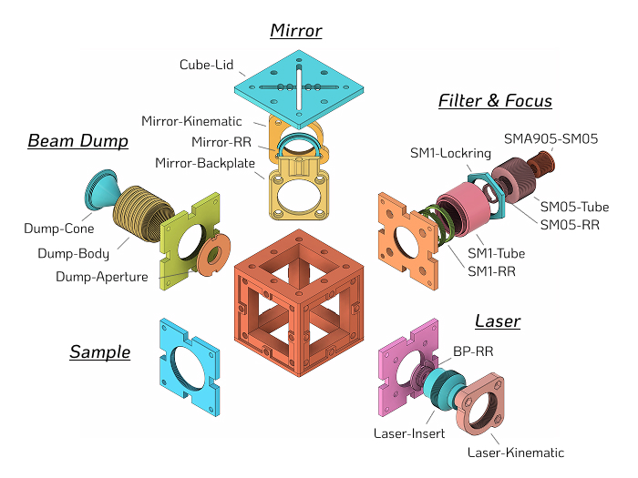

### Base Cube & Sides

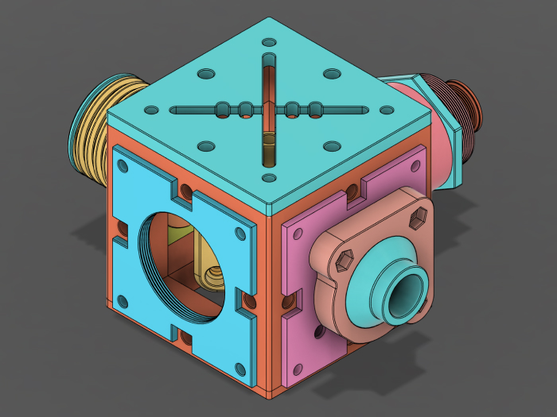

Print the base cube along with the side plates first. Afterwards print the rest of the grouped parts below.

All parts were printed without supports and are only printed once!

| Base Cube + Sides       |
| ----------------------- |
| Base-Cube               |
| Base-Cube-Top           |
| Cube-Insert_Sample      |
| Cube-Insert_Dump        |
| Cube-Insert_Laser       |
| Cube-Insert_FilterFocus |

### Parts

| **Laser**       | **Mirror**       | **Filter & Focus** | **Beam Dump** | **Sample** |
| --------------- | ---------------- | ------------------ | ------------- | ---------- |
| Laser-Insert    | Mirror-Kinematic | SM1-Tube           | Dump-Body     | -          |
| Laser-Kinematic | Mirror-Backplate | SM05-Tube          | Dump-Cone     |            |
| BP-RR           | Cube-Lid         | SM1-Lockring       | Dump-Aperture |            |
|                 | Mirror-RR        | SMA905-SM05        |               |            |
|                 |                  | SM1-RR (2x)        |               |            |
|                 |                  | SM05-RR (2x)       |               |            |

| **Extras**     |
| -------------- |
| Spanner_SM1RR  |
| Spanner_SM05RR |

Printed on a Bambu P1S using high resolution exports out of Fusion and sliced using BambuStudio

- PETG-CF (Black) 
- 0.4mm Hardened Steel Nozzle
- 0.12mm Layer height
- 4 Walls, 50% Gyroid infill
- Seam position Nearest or Random
- Precision parameters set to 0.001mm

---
## Instructions

*Full step-by-step version: [Hackaday.io Instructions](https://hackaday.io/project/205344/instructions)*

- I use a Bambu P1S with a 0.4mm hardened steel nozzle and extruder
- Filament is ideally non-reflective and dark / black to reduce stray light; I used black PETG-CF as it's my favorite and matte. The stiffer the better; PLA-CF is also a sensible alternative. 
### 1. Printing

- Set "**Precision**" settings in your slicer (*may just be placebo*) 
- **No Supports** are needed for any of the parts!
- **Print Orientation**: face flat / perpendicular to the build plate - especially for threads, which must be printed vertically for clean engagement! "**Auto-Orient**" should always do the trick.
- **Layer Height** set to at least **0.12mm**. (at least for the parts with threads or fine features) 
- "**Seam Position**" is set to **Nearest** or Random for a better fit.

- All parts should be easy to print; the Base-Cube being the most demanding, as it features overhangs. (TO BE REVISED to 45° to facilitate printing)
- For the **Cube-Inserts** and the **Cube-Lid** especially, it is best to let the build plate / part cool down before removing it. This is good practice to avoid bending the part and introducing permanent deformation.
- Also print the two spanner tools (**Spanner_SM1RR**, **Spanner_SM05RR**) - they make tightening the retaining rings much easier later.

### 2. Assembly

#### Base-Cube

**Printed Parts:** Base-Cube, Base-Cube-Top
**Sourced Parts:** (24x) M3 Heat Set Inserts (Length: 4mm, Outer Diameter: 4mm), (24x) M3 x 8mm Screws

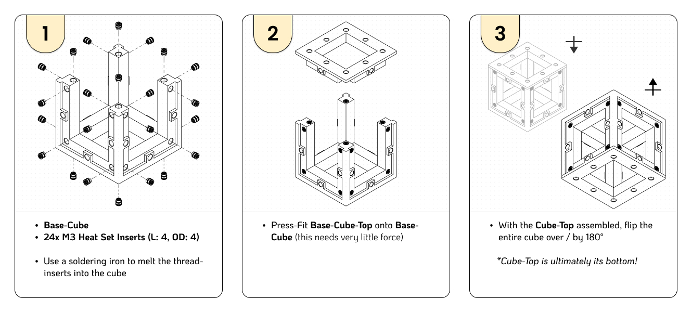

1. Melt the heat-set inserts into the bosses of the Base-Cube using a soldering iron. Keep the iron perpendicular and let the plastic - not force - do the work.
2. Fasten Base-Cube-Top with M3 x 8mm screws.

Note: You don't have to insert all the threads at first. I initially didn't put any on the bottom (of Step 1 in the graphic) and on one side, which later contains the Beam Dump and was simultaneously used as an opening to get to the adjustment screws of the 45° mirror inside. The clearances of the Cube-Inserts are relatively tight - even more, if the overhangs on the cube sag a little. In the testing stages I mostly used 2 screws (top-left and bottom-right) for each of the other Cube-Inserts (Laser, Sample, FilterFocus).  

**Now that the Base-Cube is set up you can start putting together the Cube-Insert sub-assemblies. The following sections *don't* need to be performed in order.** 

*Parts might have been slightly modified, assume this to be an outdated overview*

#### Laser

**Printed Parts:** Cube-Insert_Laser, Laser-Kinematic, Laser-Insert, BP-RR (only if Bandpass Filter is used)
**Sourced Parts:** 532nm Laser (Ø12mm), Recommended but optional: [Bandpass Filter #65640](https://www.edmundoptics.com/p/532nm-cwl-10nm-fwhm-125mm-mounted-diameter/20158/), 4x Magnets (Ø6mm, width: 2mm), 3x M3 x 8mm Screws + Nuts (Fine-Pitch .35 Screws / Nuts are preferred but normal also work)

 
*Laser and Bandpass Filter are not depicted in the graphic*

1. Press the *Magnets* into the openings on *Cube-Insert_Laser*. 
	1. Since the respective mating part - *Laser-Kinematic* - features 3 screws, you can also insert just 3 magnets. Though keep in mind that this will allow more stray light to enter the cube. 
2. Now press the *M3 Nuts* into *Laser-Kinematic*.
3. For best results use a hammer on the screw head while inserted to ensure the nuts are flush and inserted all the way.
	1. If you want them permanently fixed, you may use a soldering iron to lightly melt the nuts in. This isn't necessary with current sufficiently tight clearances.
4. The *Laser* module is friction press-fit into *Laser-Insert*. Ensure the Laser's front surface sits perpendicularly flush.
5. Now press the *Bandpass Filter* into the other side of *Laser-Insert*.
	1. The orientation is important as both sides feature different coatings: the purple side should face you (so you see purple when assembled). 
	2. KEEP LASER DISCONNECTED AND NEVER LOOK DIRECTLY INTO THE LASER, EVEN WHEN WEARING LASER-PROTECTION!
6. It should already sit tight, but in addition *BP-RR* is lightly screwed on until it secures the rim of the filter.
7. Finally screw the assembled *Laser-Insert* into the printed thread of *Laser-Kinematic*.
8. With the entire laser and filter assembly now sitting on *Cube-Insert_Laser*, it can be pressed into a side of *Base-Cube* and fastened with 4 screws.

**Powering the Laser:** The module is specced for 3.7V, but I run it at **2.7-3.0V** from a bench supply via its two bare leads (or via a voltage regulator from a powerbank now). Higher voltage doesn't buy a cleaner beam - just more heat (I'm not using the heatsink yet, as my magnets are too weak to carry the added weight) and more noise. The lower range has been the better operating point in my measurements.

#### Sample

**Printed Parts:** Cube-Insert_Sample
**Sourced Parts:** Microscope Objective (20x, Infinity-Corrected, M32-Thread)

1. Make sure the *Microscope Objective* thread matches the printed part (currently only M32 and M25 available, contact me at Jacob@Busshart.de for variations)
2. With the *Microscope Objective* positioned perpendicular on the thread, carefully thread it into *Cube-Insert_Sample*. This may require more force initially, especially the first time. 
3. When the *Microscope Objective* sits flush with the surface of *Cube-Insert_Sample*, the assembly can be pressed into the side to the left of *Cube-Insert_Laser* (or as depicted in the graphic) and fastened with 4 screws.

Note on working distance: the objective's working distance decides what you can measure through container walls. Mine is 2.4mm - enough to measure ethanol *through* a plastic bottle wall (see [Various](#various)).

*MORE FOR THE FULL MICROMETER ASSEMBLY / FOCUS STAGE COMING SOON*

#### Dichroic Mirror

**Printed Parts:** Mirror-Kinematic, Mirror-Backplate, Mirror-RR, Cube-Lid
**Sourced Parts:** DMLP550, 3x M3 Screws + Nuts, Magnets (Ø6mm, width: 2mm)

*Be mindful of the orientation of both the **FELH0550** and the **DMLP550** as they have to be installed in the correct orientation. Make sure the direction on the rim of both optics corresponds with the arrows in the graphic below:*

1. Seat the *DMLP550* in the 45° pocket of *Mirror-Kinematic* and secure it with *Mirror-RR*. Handle the dichroic by its edges only - fingerprints on the coating directly cost signal.
2. Press the *M3 Nuts* and *Magnets* into *Mirror-Backplate* / *Mirror-Kinematic* analogous to the Laser assembly: the magnets preload the mirror platform against the 3 adjustment screws, providing tip/tilt.
3. Lower the assembly into *Base-Cube* and close the top with *Cube-Lid*.
4. The adjustment screws remain reachable through the (still open) Beam Dump side of the cube for alignment.

#### Beam Dump

**Printed Parts:** Cube-Insert_Dump, Dump-Body, Dump-Cone, Dump-Aperture
**Sourced Parts:** -

1. Screw the printed parts together.
2. *Dump-Body* being the main part, which is screwed into *Cube-Insert_Dump*. 
3. Screw on the *Dump-Cone* to create a light-sealed cavity.
4. *Dump-Aperture* is screwed on from the opposite side or as depicted in the graphic.
	1. This aperture is not strictly necessary but could improve light suppression.

The dump sits opposite the laser: the laser light that transmits straight through the dichroic (plus Rayleigh-scattered 532nm returning from the sample) ends up trapped here instead of bouncing around the cube. The Beam Dump as a whole was designed to be as modular as possible to allow for different cone angles and aperture sizes to be tested and interchanged.

**Tip:** Leave this insert unfastened until alignment is finished - its opening is your access port to the mirror adjustment screws.

#### Filter & Focus

**Printed Parts:** Cube-Insert_FilterFocus, SM1-Tube, SM05-Tube, SM1-Lockring, SMA905-SM05, (2x) SM1-RR, (2x) SM05-RR + Spanner_SM1RR, Spanner_SM05RR
**Sourced Parts:** FELH0550 Longpass Filter, AC127-019-A Achromatic Doublet, B&W Tek BTC 100-2S

 
*Longpass Filter, Focusing Lens and Spectrometer unit are not depicted in the graphic*

This is the detection arm: collimated Raman light exits the dichroic, gets a second stage of Rayleigh rejection from the longpass filter, and is focused by the achromat onto the spectrometer's 100μm slit.

*Be mindful of the orientation of the **FELH0550** - make sure the direction on the rim corresponds with the arrows in the orientation graphic above.*

1. Thread one *SM1-RR* into *SM1-Tube* as the lower seat - it determines the axial position of the filter.
2. Drop in the *FELH0550* and clamp it flat with the second *SM1-RR* from above.
	1. The printed rings are only 2-2.5mm thick and somewhat flexible: thread them in with **pure rotation, no downward force**, keeping them as perpendicular as possible so the filter sits truly square.
	2. Use the printed *Spanner_SM1RR* - it engages the two openings of the ring and prevents it from going in crooked.
3. Mount the *Achromatic Doublet* into *SM05-Tube* between the two *SM05-RR*, same technique (use *Spanner_SM05RR*).
	1. **Orientation matters:** the more strongly curved surface faces the collimated beam (toward the cube), not the focused end - check this when removing the lens from its shipping mount.
4. Thread *SM05-Tube* into *SM1-Tube*. Their relative thread position is the **focus adjustment** onto the slit.
5. Couple to the spectrometer via the *SMA905-SM05* adapter: the output of the lens tube screws directly onto the SMA905 input of the spectrometer. Clean and rigid, no fiber run between optics and detector.
	1. Alternatively, use the optional SMA905 fiber (~200μm core) if the spectrometer should be positioned remotely, though this might require additional adjustment options for efficient coupling.
6. Fasten *Cube-Insert_FilterFocus* into the cube side opposite the Sample port. Once the focus is finalized during alignment you can optionally clamp everything with *SM1-Lockring*.

**Spectrometer hookup:** 5V / 2A+ barrel-jack supply for power, RS232-to-USB cable for communication with the computer. I reuploaded the original **SpectrumStudio** acquisition software [here](https://drive.google.com/file/d/1ooKja8GXg5gMX-swFjbmAXFP61ucyWT_/view?usp=sharing). (Alternatively you can write your own software to communicate with the spectrometer via the serial connection.)

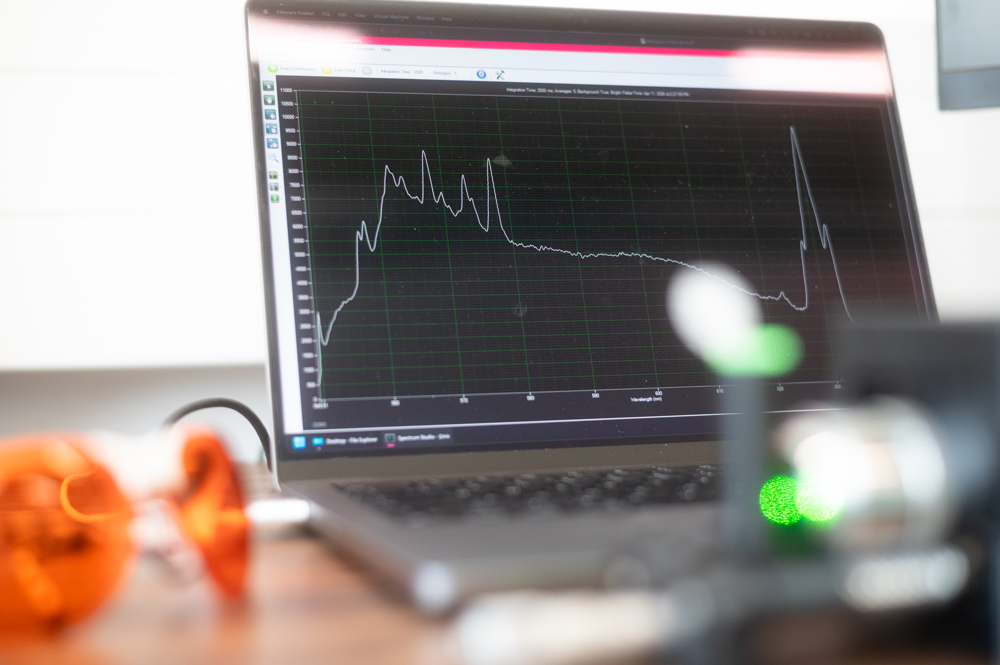

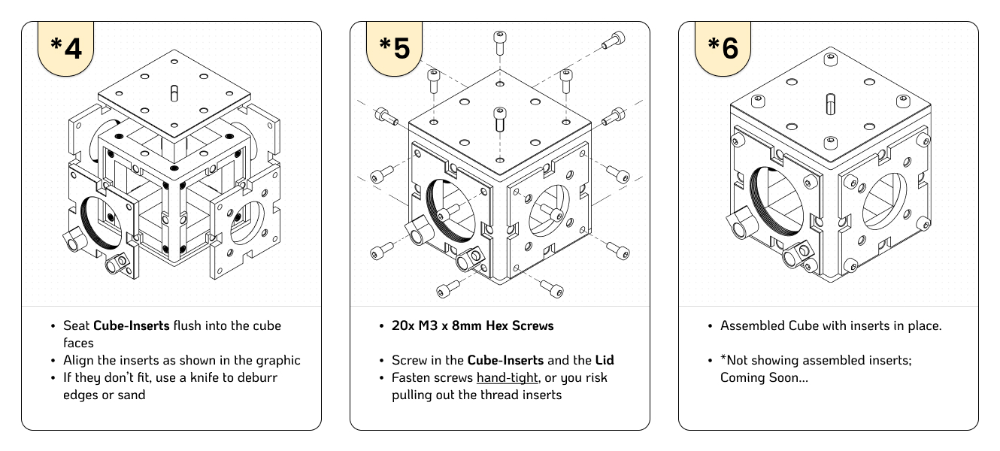

---

## Calibration, Alignment & First Light

**Spectrometer calibration** is an important prerequisite. Use a calibration lamp, any CFL (with a known spectrum) or a mercury vapor lamp: acquire a spectrum of exclusively said lamp in a dark room, note the pixel index of each line in SpectrumStudio and match it with the corresponding reference wavelength from your source. With more than 4 points sampled - ideally as many as you can get - enter them into the table in SpectrumStudio, which automatically calculates the correct calibration coefficients.

⚠ **Glasses on. Room cleared of reflective clutter. Lowest usable laser voltage (~2.7V).**

1. With the Beam Dump insert still off, power the laser and check that the beam hits the dichroic centrally and exits through the objective.
2. Use the laser's kinematic screws (magnet-preloaded tip/tilt) to center the beam on the objective's back aperture; use the mirror's kinematic screws - reached through the dump opening - to make the beam exit the objective straight and centered.
3. Place a strong Raman scatterer with a known spectrum at the focus. Good first samples: **polypropylene** (any PP container), **isopropyl alcohol**, or - if you have one - a **diamond**, whose single sharp line at 1332cm-1 can be a nice start.
4. Take continuous acquisitions (around 1000ms) while slowly adjusting the SM05/SM1 tube focus and the sample distance until the Raman peaks maximize. Expect this to be iterative between laser tilt, mirror tilt, and focus.
5. Optionally lock the *SM1-Lockring*, install the Beam Dump, and close up the cube.

For liquids in containers: thin-walled vials/cuvettes work best; thick glass mostly returns the silica spectrum of the glass itself (see the working distance note in [Sample](#sample)).

---

## Software

**Acquisition:** [SpectrumStudio](https://drive.google.com/file/d/1ooKja8GXg5gMX-swFjbmAXFP61ucyWT_/view?usp=sharing) (reupload of the original B&W Tek software) via the RS232-to-USB connection - or write your own via the serial protocol.

- Raman-shift conversion (532nm excitation) and cropping to the usable 600-3000cm-1 window
- Cosmic spike removal (modified Z-score on the derivative)
- Baseline correction: **ALS**, **arPLS** or **SNIP**
- Savitzky-Golay smoothing and normalization
- Pseudo-Voigt peak detection and fitting
- Reference-library matching (peak scoring + cosine similarity) with overlays and CSV export - only if you have a library file, as I unfortunately can't provide that

---

## **Build Video**

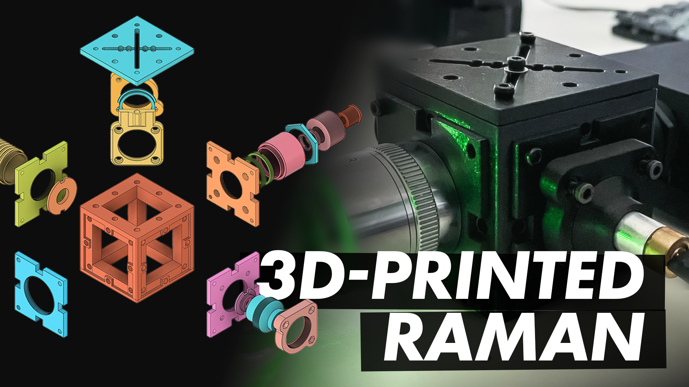

**[Click here to watch the build process! - Youtube](https://youtu.be/bUxc6mWsTgc)**

[Click here to watch the library-matching update! - Youtube](https://www.youtube.com/watch?v=tDqg5P3a8J0)

--- 

## Various

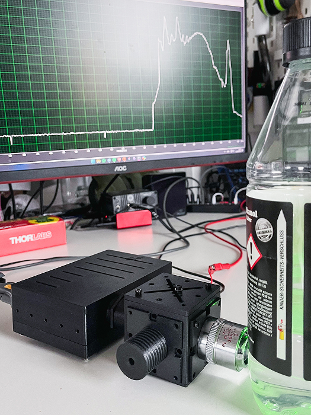

Testing capabilities during calibration in full daylight: depending on the focus distance you either detect the Raman spectrum of the bottle content - in this case Ethanol/Water - or the bottle itself. This only works if your microscope objective's working distance is greater than the wall width of the container to be measured. Here the working distance is 2.4mm, which is sufficient.

---

Questions? Jacob@Busshart.de - or comment on the [video](https://youtu.be/bUxc6mWsTgc).
